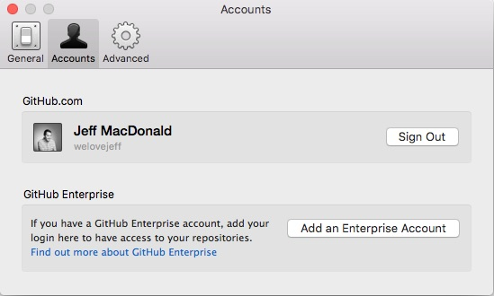
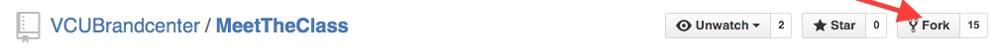

# Meet The Class
A fun way to learn Github and meet each other

Fork your own copy and then send me a pull request once you've added your folder with your info. Copy my folder to use as a reference.

# Full Instructions
1. Signup for Github
2. Download the Github App - [Mac](https://mac.github.com/) or [Windows](https://windows.github.com)
3. Login to your Github account in the app's preference screen  

4. Open the [MeetTheClass Repository](https://github.com/VCUBrandcenter/MeetTheClass)
2. Fork it to your account!!!  
  
6. Clone to your desktop
7. Copy JeffMacDonald Folder, it's our template
8. Change folders name to your name, no spaces!
9. Make small or large changes using a text editor, I recommend [Atom](http://atom.io/ "Atom")  (Try changing the colors of the background in the CSS2 file)
10. Commit those changes in GitHub App
11. Go to Github.com add create a pull request with the main branch
12. I’ll accept your pull request and merge our code your site will be live!
